# GitHub Actions Setup Guide (OIDC Authentication)

This guide explains how to configure GitHub Secrets and Variables to enable automated CI/CD deployment to AWS using OIDC (OpenID Connect) for keyless authentication.

## 📋 Prerequisites

✅ **MUST complete first**: [AWS Manual Setup Guide](./AWS-MANUAL-SETUP.md)

You should have already created:
1. Three S3 buckets (frontend, deployments, assets)
2. OIDC provider for GitHub in AWS
3. GitHubActionsDeploymentRole IAM role with trust policy
4. GitHub repository: `germanngc/treff-poc` on `main` branch

---

## 🔐 Authentication: OIDC (No Long-Lived Keys!)

This setup uses **OpenID Connect (OIDC)** instead of AWS access keys:

### Why OIDC? ✅
- ✅ **No long-lived credentials** stored in GitHub
- ✅ **Automatic token rotation** (short-lived tokens per workflow run)
- ✅ **Better security** - tokens expire after use
- ✅ **No key management** - no rotation needed
- ✅ **Fine-grained access** - scoped to specific repository/branch

### How It Works:
```
GitHub Actions → Requests token from GitHub OIDC provider
                ↓
AWS verifies token with GitHub OIDC provider
                ↓
AWS assumes GitHubActionsDeploymentRole
                ↓
Short-lived credentials issued for workflow run
```

---

## 🔐 GitHub Secrets (Sensitive Data)

Navigate to: **Settings → Secrets and variables → Actions → Secrets**

### Required Secrets (3 total)

#### 1. MySQL Root Password

**`MYSQL_ROOT_PASSWORD`**
- **Description**: MySQL root password for database on EC2
- **Value**: Strong password (16+ characters, mix of letters/numbers/symbols)
- **Example**: `MySecureRoot2024!Password`
- ⚠️ **Security**: Never commit this to code!

#### 2. MySQL Application Password

**`MYSQL_PASSWORD`**
- **Description**: MySQL application user password (treff_user)
- **Value**: Strong password (16+ characters, mix of letters/numbers/symbols)
- **Example**: `MySecureApp2024!Password`
- ⚠️ **Security**: Different from root password!

#### 3. ICP Identity (Optional - Only if using Internet Computer)

**`DFX_IDENTITY`**
- **Description**: DFX identity PEM file for ICP deployment
- **How to get it**:
  ```bash
  dfx identity export github-actions > identity.pem
  cat identity.pem  # Copy the entire contents
  ```
- **Value**: Full contents of the PEM file
- **When needed**: Only if deploying `apps/icp`

---

## 📊 GitHub Variables (Non-Sensitive Configuration)

Navigate to: **Settings → Secrets and variables → Actions → Variables**

### Required Variables (7 total)

#### 1. AWS Region

**`AWS_REGION`**
- **Description**: AWS region where resources are deployed
- **Value**: `us-east-1` (or your chosen region)
- **Must match**: Region where you created OIDC provider and IAM role

#### 2. AWS IAM Role ARN (OIDC)

**`AWS_ROLE_ARN`**
- **Description**: ARN of GitHubActionsDeploymentRole for OIDC authentication
- **How to get it**:
  ```bash
  aws iam get-role --role-name GitHubActionsDeploymentRole \
    --query 'Role.Arn' --output text
  ```
- **Value**: `arn:aws:iam::123456789012:role/GitHubActionsDeploymentRole`
- **Created in**: [AWS Manual Setup Guide](./AWS-MANUAL-SETUP.md)

#### 3. Frontend S3 Bucket

**`FRONTEND_BUCKET_NAME`**
- **Description**: S3 bucket for hosting React frontend (static website)
- **Value**: `treff-frontend-prod` (bucket name you created)
- **Created in**: [AWS Manual Setup Guide](./AWS-MANUAL-SETUP.md)

#### 4. Deployment Artifacts Bucket

**`DEPLOYMENT_BUCKET_NAME`**
- **Description**: S3 bucket for temporary deployment artifacts (backend builds)
- **Value**: `treff-deployments-prod` (bucket name you created)
- **Created in**: [AWS Manual Setup Guide](./AWS-MANUAL-SETUP.md)

#### 5. Assets S3 Bucket

**`ASSETS_BUCKET_NAME`**
- **Description**: S3 bucket for user-uploaded files/images
- **Value**: `treff-assets-prod` (bucket name you created)
- **Created in**: [AWS Manual Setup Guide](./AWS-MANUAL-SETUP.md)

#### 6. CloudFront Distribution ID

**`CLOUDFRONT_DISTRIBUTION_ID`**
- **Description**: CloudFront distribution ID for cache invalidation
- **How to get it**: After CDK deployment:
  ```bash
  aws cloudfront list-distributions \
    --query "DistributionList.Items[?Comment=='Treff Frontend Distribution'].Id" \
    --output text
  ```
- **Value**: `E1234567890ABC` (your distribution ID)
- ⚠️ **Note**: Set this AFTER first CDK deployment

#### 7. Backend API URL

**`BACKEND_API_URL`**
- **Description**: Backend API URL for frontend configuration
- **How to get it**: After CDK deployment (EC2 public IP):
  ```bash
  aws ec2 describe-instances \
    --filters "Name=tag:Name,Values=TreffInfrastructureStack/TreffEC2Instance" \
    --query "Reservations[0].Instances[0].PublicIpAddress" \
    --output text
  ```
- **Value**: `http://54.123.45.67` (your EC2 public IP)
- ⚠️ **Note**: Set this AFTER first CDK deployment

---

## 🛠️ Step-by-Step Setup

### Step 1: Verify AWS Prerequisites

Ensure you completed [AWS Manual Setup](./AWS-MANUAL-SETUP.md):

```bash
# 1. Verify OIDC provider exists
aws iam list-open-id-connect-providers

# 2. Verify IAM role exists
aws iam get-role --role-name GitHubActionsDeploymentRole

# 3. Verify S3 buckets exist
aws s3 ls | grep treff

# Expected output:
# treff-frontend-prod
# treff-deployments-prod
# treff-assets-prod
```

### Step 2: Create GitHub Environment

1. Go to: **https://github.com/germanngc/treff-poc/settings/environments**
2. Click **New environment**
3. Name it: `production`
4. Click **Configure environment**
5. **(Recommended)** Add protection rules:
   - ✅ **Required reviewers**: Add yourself or team members
   - ✅ **Deployment branches**: Select "Selected branches" → Add `main`
   - ❌ **Wait timer**: Skip for now (or set to 5 minutes)

### Step 3: Add GitHub Secrets

Go to: **https://github.com/germanngc/treff-poc/settings/secrets/actions**

Click **New repository secret** for each:

| Secret Name | Value | Example |
|-------------|-------|---------|
| `MYSQL_ROOT_PASSWORD` | Your root password | `MySecureRoot2024!Password` |
| `MYSQL_PASSWORD` | Your app password | `MySecureApp2024!Password` |
| `DFX_IDENTITY` | PEM file contents | _(Only if using ICP)_ |

### Step 4: Add GitHub Variables

Go to: **https://github.com/germanngc/treff-poc/settings/variables/actions**

Click **New repository variable** for each:

| Variable Name | Value | Example |
|---------------|-------|---------|
| `AWS_REGION` | Your AWS region | `us-east-1` |
| `AWS_ROLE_ARN` | GitHubActionsDeploymentRole ARN | `arn:aws:iam::123456789012:role/GitHubActionsDeploymentRole` |
| `FRONTEND_BUCKET_NAME` | Frontend bucket name | `treff-frontend-prod` |
| `DEPLOYMENT_BUCKET_NAME` | Deployments bucket name | `treff-deployments-prod` |
| `ASSETS_BUCKET_NAME` | Assets bucket name | `treff-assets-prod` |
| `CLOUDFRONT_DISTRIBUTION_ID` | _(After CDK deployment)_ | `E1234567890ABC` |
| `BACKEND_API_URL` | _(After CDK deployment)_ | `http://54.123.45.67` |

⚠️ **Note**: `CLOUDFRONT_DISTRIBUTION_ID` and `BACKEND_API_URL` will be set after first infrastructure deployment.

### Step 5: Deploy Infrastructure (First Time)

From your local machine:

```bash
# 1. Navigate to infrastructure directory
cd infrastructure

# 2. Install dependencies
npm install

# 3. Copy environment template
cp .env.template .env

# 4. Edit .env with your values
nano .env
# Set:
# - MYSQL_ROOT_PASSWORD (same as GitHub secret)
# - MYSQL_PASSWORD (same as GitHub secret)
# - FRONTEND_BUCKET_NAME=treff-frontend-prod
# - ASSETS_BUCKET_NAME=treff-assets-prod

# 5. Bootstrap CDK (one-time)
cdk bootstrap

# 6. Deploy infrastructure
npm run deploy

# 7. Save the outputs!
```

**From CDK outputs, copy these values to GitHub Variables:**

```bash
# Get CloudFront Distribution ID
aws cloudfront list-distributions \
  --query "DistributionList.Items[?Comment=='Treff Frontend Distribution'].Id" \
  --output text
# → Add to GitHub Variables as CLOUDFRONT_DISTRIBUTION_ID

# Get EC2 Public IP
aws ec2 describe-instances \
  --filters "Name=tag:Name,Values=TreffInfrastructureStack/TreffEC2Instance" \
  --query "Reservations[0].Instances[0].PublicIpAddress" \
  --output text
# → Add to GitHub Variables as BACKEND_API_URL (with http:// prefix)
```

### Step 6: Test OIDC Authentication

Make a small change and push to test the workflow:

```bash
# 1. Make a test change
echo "# Test OIDC deployment" >> README.md

# 2. Commit and push
git add README.md
git commit -m "test: Verify OIDC authentication in GitHub Actions"
git push origin main

# 3. Watch the workflow
# Go to: https://github.com/germanngc/treff-poc/actions
```

**Expected workflow steps:**
1. ✅ Changes detected
2. ✅ Configure AWS credentials (OIDC) - **No access keys used!**
3. ✅ CDK Diff
4. ✅ CDK Deploy
5. ✅ Deploy backend/frontend (if changed)

**If you see errors like:**
- `Error: Could not assume role` → Verify AWS_ROLE_ARN is correct
- `Error: Invalid identity token` → Check OIDC provider thumbprint
- `Error: Access denied` → Review IAM role permissions policy

---

## ✅ Setup Checklist

Use this checklist to ensure all configurations are complete:

### Prerequisites ✓
- [ ] ✅ Completed [AWS Manual Setup](./AWS-MANUAL-SETUP.md) guide
- [ ] ✅ OIDC provider created in AWS (`token.actions.githubusercontent.com`)
- [ ] ✅ GitHubActionsDeploymentRole IAM role created with trust policy
- [ ] ✅ Three S3 buckets created (frontend, deployments, assets)

### GitHub Environment ✓
- [ ] Created `production` environment in GitHub
- [ ] **(Optional)** Added deployment protection rules
- [ ] Restricted to `main` branch only

### GitHub Secrets ✓
- [ ] `MYSQL_ROOT_PASSWORD` (strong password, 16+ chars)
- [ ] `MYSQL_PASSWORD` (strong password, 16+ chars)
- [ ] `DFX_IDENTITY` (only if using ICP)

### GitHub Variables ✓
- [ ] `AWS_REGION` (e.g., `us-east-1`)
- [ ] `AWS_ROLE_ARN` (GitHubActionsDeploymentRole ARN)
- [ ] `FRONTEND_BUCKET_NAME` (manually created bucket)
- [ ] `DEPLOYMENT_BUCKET_NAME` (manually created bucket)
- [ ] `ASSETS_BUCKET_NAME` (manually created bucket)
- [ ] `CLOUDFRONT_DISTRIBUTION_ID` (from CDK outputs after deployment)
- [ ] `BACKEND_API_URL` (EC2 public IP after deployment)

### Infrastructure Deployed ✓
- [ ] CDK bootstrap completed
- [ ] CDK deployment successful
- [ ] EC2 instance running
- [ ] CloudFront distribution created
- [ ] Retrieved CloudFront Distribution ID
- [ ] Retrieved EC2 Public IP

### Verification ✓
- [ ] All secrets show as **"Set"** in GitHub
- [ ] All variables display correct values
- [ ] Pushed test commit to `main` branch
- [ ] GitHub Actions workflow completed successfully
- [ ] OIDC authentication worked (no "AWS Access Key" errors)
- [ ] Backend deployed to EC2
- [ ] Frontend deployed to S3
- [ ] CloudFront cache invalidated

---

## 🔒 Security Best Practices

### 1. OIDC Authentication ✅
- ✅ **No long-lived credentials** stored in GitHub Secrets
- ✅ **Tokens expire** after each workflow run
- ✅ **Scoped to repository** - only `germanngc/treff-poc` can assume role

### 2. IAM Role Least Privilege
Review the permissions policy in GitHubActionsDeploymentRole:
```bash
aws iam get-role-policy \
  --role-name GitHubActionsDeploymentRole \
  --policy-name GitHubActionsDeploymentPolicy
```

**Principle**: Only grant permissions needed for deployment.

### 3. Trust Policy Restrictions
The OIDC trust policy should restrict:
- ✅ **Repository**: Only `germanngc/treff-poc`
- ✅ **Branch**: Only `main` (or `ref:refs/heads/main`)
- ✅ **Environment**: Only `production` (optional)

Example check:
```bash
aws iam get-role --role-name GitHubActionsDeploymentRole \
  --query 'Role.AssumeRolePolicyDocument'
```

### 4. Enable AWS CloudTrail
Monitor all AWS API calls from GitHub Actions:
```bash
aws cloudtrail lookup-events \
  --lookup-attributes AttributeKey=Username,AttributeValue=GitHubActionsDeploymentRole \
  --max-results 10
```

### 5. GitHub Environment Protection
- ✅ **Required reviewers** for production deployments
- ✅ **Deployment branches** restricted to `main` only
- ✅ **Audit logs** - review Actions tab regularly

### 6. Rotate MySQL Passwords
While OIDC eliminates AWS key rotation, still rotate database passwords:
```bash
# Every 90 days, update:
# 1. MySQL passwords in EC2
# 2. GitHub Secrets (MYSQL_ROOT_PASSWORD, MYSQL_PASSWORD)
# 3. Application configuration
```

### 7. Monitor IAM Access Analyzer
Check for unintended public access:
```bash
aws accessanalyzer list-analyzers
aws accessanalyzer list-findings --analyzer-arn <ARN>
```

---

## 🐛 Troubleshooting

### "Could not assume role" Error

**Symptom**: Workflow fails with `Error: Could not assume role with OIDC`

**Solutions**:
```bash
# 1. Verify OIDC provider exists
aws iam list-open-id-connect-providers

# 2. Verify role ARN is correct
aws iam get-role --role-name GitHubActionsDeploymentRole

# 3. Check trust policy allows your repository
aws iam get-role --role-name GitHubActionsDeploymentRole \
  --query 'Role.AssumeRolePolicyDocument'
# Should contain:
# - "token.actions.githubusercontent.com:sub": "repo:germanngc/treff-poc:ref:refs/heads/main"
```

### "Invalid identity token" Error

**Symptom**: Workflow fails during AWS credentials configuration

**Solutions**:
```bash
# 1. Verify OIDC provider thumbprint is correct
aws iam get-open-id-connect-provider \
  --open-id-connect-provider-arn arn:aws:iam::ACCOUNT_ID:oidc-provider/token.actions.githubusercontent.com

# Expected thumbprint (as of 2024):
# 6938fd4d98bab03faadb97b34396831e3780aea1

# 2. If incorrect, update:
aws iam update-open-id-connect-provider-thumbprint \
  --open-id-connect-provider-arn arn:aws:iam::ACCOUNT_ID:oidc-provider/token.actions.githubusercontent.com \
  --thumbprint-list 6938fd4d98bab03faadb97b34396831e3780aea1
```

### "Access denied" During Deployment

**Symptom**: Workflow authenticates but fails to deploy resources

**Solutions**:
```bash
# 1. Verify IAM role has deployment permissions
aws iam get-role-policy \
  --role-name GitHubActionsDeploymentRole \
  --policy-name GitHubActionsDeploymentPolicy

# 2. Test permissions locally (simulate)
aws sts assume-role \
  --role-arn arn:aws:iam::123456789012:role/GitHubActionsDeploymentRole \
  --role-session-name test-session
```

### Backend Deployment Fails (SSM Issues)

**Symptom**: Backend deployment times out or fails with SSM errors

**Solutions**:
```bash
# 1. Verify EC2 instance is registered with SSM
aws ssm describe-instance-information

# 2. Check SSM agent status on EC2
# SSH to instance (first time only):
sudo systemctl status snap.amazon-ssm-agent.amazon-ssm-agent

# 3. Test SSM command execution
INSTANCE_ID=$(aws ec2 describe-instances \
  --filters "Name=tag:Name,Values=TreffInfrastructureStack/TreffEC2Instance" \
  --query "Reservations[0].Instances[0].InstanceId" --output text)

aws ssm send-command \
  --instance-ids $INSTANCE_ID \
  --document-name "AWS-RunShellScript" \
  --parameters 'commands=["echo Hello from SSM"]'
```

### Frontend Not Updating

**Symptom**: Deployment succeeds but frontend shows old content

**Solutions**:
```bash
# 1. Verify S3 bucket was updated
aws s3 ls s3://treff-frontend-prod/ --recursive | tail -5

# 2. Check CloudFront invalidation
aws cloudfront list-invalidations \
  --distribution-id $CLOUDFRONT_DISTRIBUTION_ID

# 3. Manual cache invalidation
aws cloudfront create-invalidation \
  --distribution-id $CLOUDFRONT_DISTRIBUTION_ID \
  --paths "/*"
```

---

## 📚 Additional Resources

- [GitHub Actions OIDC with AWS](https://docs.github.com/en/actions/deployment/security-hardening-your-deployments/configuring-openid-connect-in-amazon-web-services)
- [AWS IAM OIDC Providers](https://docs.aws.amazon.com/IAM/latest/UserGuide/id_roles_providers_create_oidc.html)
- [GitHub Actions Security Best Practices](https://docs.github.com/en/actions/security-guides/security-hardening-for-github-actions)
- [AWS CDK Documentation](https://docs.aws.amazon.com/cdk/)
- [AWS Systems Manager Documentation](https://docs.aws.amazon.com/systems-manager/)

---

## 🔄 Workflow Architecture

```mermaid
graph TD
    A[Push to main branch] --> B[GitHub Actions Workflow]
    B --> C[Request OIDC token from GitHub]
    C --> D[AWS verifies token with GitHub]
    D --> E[AWS assumes GitHubActionsDeploymentRole]
    E --> F[Short-lived credentials issued]
    
    F --> G{Changes Detected?}
    G -->|Infrastructure| H[CDK Deploy]
    G -->|Backend| I[Build .NET App]
    G -->|Frontend| J[Build React App]
    
    H --> K[Update VPC/EC2/S3/CloudFront]
    I --> L[Upload to S3 → Deploy via SSM]
    J --> M[Sync to S3 → Invalidate CloudFront]
    
    L --> N[EC2 Instance]
    M --> O[CloudFront CDN]
    
    style C fill:#4CAF50
    style D fill:#4CAF50
    style E fill:#4CAF50
    style F fill:#4CAF50
```



---

**Last Updated**: December 2024  
**Authentication Method**: OIDC (OpenID Connect) ✅  
**No Long-Lived Credentials**: ✅

