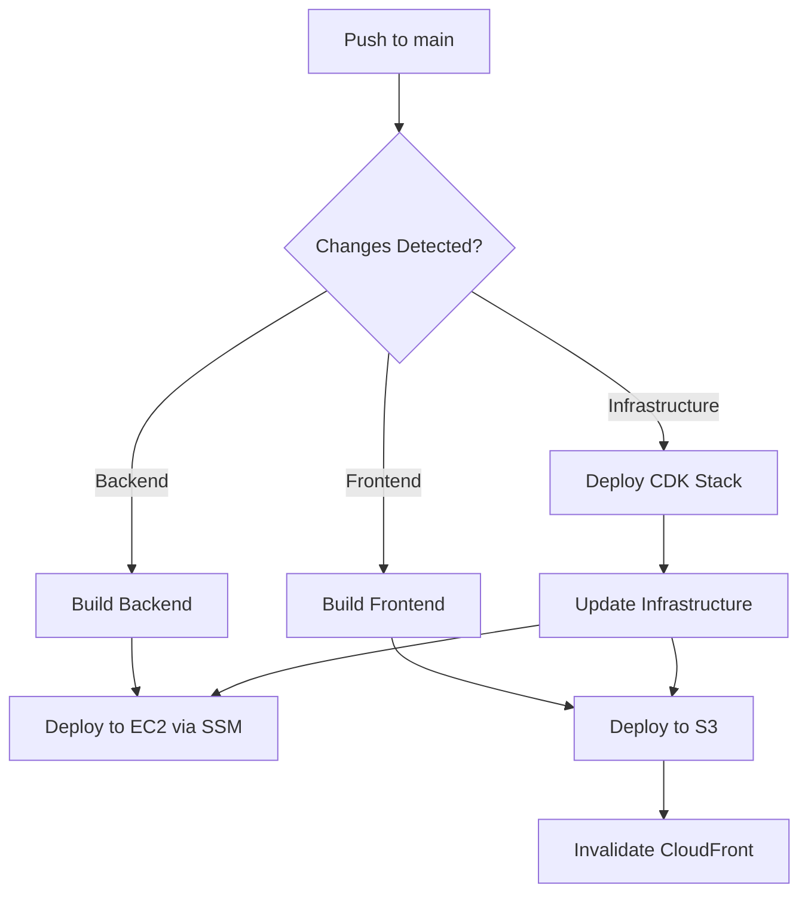

# GitHub Actions Setup Guide

This guide explains how to configure GitHub Secrets and Variables to enable automated CI/CD deployment to AWS.

## 📋 Prerequisites

1. AWS account with CDK infrastructure deployed
2. AWS IAM user with programmatic access
3. GitHub repository for your project
4. EC2 instance running (after CDK deployment)

---

## 🔐 GitHub Secrets (Sensitive Data)

Navigate to: **Settings → Secrets and variables → Actions → Secrets**

### Required Secrets

#### 1. AWS Credentials

**`AWS_ACCESS_KEY_ID`**
- **Description**: AWS IAM Access Key ID for deployment
- **How to get it**:
  ```bash
  # Create IAM user with deployment permissions
  aws iam create-user --user-name github-actions-deployer
  
  # Attach required policies
  aws iam attach-user-policy --user-name github-actions-deployer \
    --policy-arn arn:aws:iam::aws:policy/AmazonEC2FullAccess
  
  aws iam attach-user-policy --user-name github-actions-deployer \
    --policy-arn arn:aws:iam::aws:policy/AmazonS3FullAccess
  
  aws iam attach-user-policy --user-name github-actions-deployer \
    --policy-arn arn:aws:iam::aws:policy/CloudFrontFullAccess
  
  aws iam attach-user-policy --user-name github-actions-deployer \
    --policy-arn arn:aws:iam::aws:policy/AmazonSSMFullAccess
  
  # Create access key
  aws iam create-access-key --user-name github-actions-deployer
  ```
- **Value**: Copy the `AccessKeyId` from the output

**`AWS_SECRET_ACCESS_KEY`**
- **Description**: AWS IAM Secret Access Key
- **Value**: Copy the `SecretAccessKey` from the output above
- ⚠️ **Important**: Save this immediately - it's only shown once!

#### 2. MySQL Passwords

**`MYSQL_ROOT_PASSWORD`**
- **Description**: MySQL root password for RDS/EC2
- **Value**: Same password you used in `infrastructure/.env`
- **Example**: `YourSecureRootPassword123!`

**`MYSQL_PASSWORD`**
- **Description**: MySQL application user password
- **Value**: Same password you used in `infrastructure/.env`
- **Example**: `YourSecureUserPassword123!`

#### 3. Deployment Bucket (Optional)

**`DEPLOYMENT_BUCKET`**
- **Description**: S3 bucket for temporary deployment artifacts
- **How to create**:
  ```bash
  aws s3 mb s3://treff-deployments-$(aws sts get-caller-identity --query Account --output text)
  ```
- **Value**: Bucket name (e.g., `treff-deployments-123456789012`)
- **Note**: This is used to transfer the backend build to EC2

#### 4. ICP Identity (Optional - only if deploying to ICP)

**`DFX_IDENTITY`**
- **Description**: DFX identity PEM file for ICP deployment
- **How to get it**:
  ```bash
  dfx identity export github-actions > identity.pem
  cat identity.pem  # Copy the contents
  ```
- **Value**: Full contents of the PEM file

---

## 📊 GitHub Variables (Non-Sensitive Configuration)

Navigate to: **Settings → Secrets and variables → Actions → Variables**

### Required Variables

**`AWS_REGION`**
- **Description**: AWS region for deployment
- **Value**: `us-east-2` (or your chosen region)

**`BACKEND_API_URL`**
- **Description**: Backend API URL for frontend configuration
- **How to get it**: After CDK deployment, this is the EC2 Public IP
- **Value**: `http://<EC2_PUBLIC_IP>` (e.g., `http://54.123.45.67`)
- ⚠️ **Note**: Update this after first infrastructure deployment

**`FRONTEND_BUCKET_NAME`**
- **Description**: S3 bucket name for frontend hosting
- **How to get it**: From CDK deployment outputs
- **Value**: `treff-frontend-123456789012` (your bucket name)
- ⚠️ **Note**: Update this after first infrastructure deployment

**`CLOUDFRONT_DISTRIBUTION_ID`**
- **Description**: CloudFront distribution ID
- **How to get it**: From CDK deployment outputs
- **Value**: `E1234567890ABC` (your distribution ID)
- ⚠️ **Note**: Update this after first infrastructure deployment

---

## 🛠️ Step-by-Step Setup

### Step 1: Create GitHub Environment

1. Go to **Settings → Environments**
2. Click **New environment**
3. Name it `production`
4. Click **Configure environment**
5. (Optional) Add protection rules:
   - ✅ Required reviewers
   - ✅ Wait timer
   - ✅ Deployment branches: `main` only

### Step 2: Create IAM User for GitHub Actions

```bash
# 1. Create IAM user
aws iam create-user --user-name github-actions-deployer

# 2. Create inline policy for CDK deployment
cat > github-actions-policy.json <<EOF
{
  "Version": "2012-10-17",
  "Statement": [
    {
      "Effect": "Allow",
      "Action": [
        "cloudformation:*",
        "ec2:*",
        "s3:*",
        "cloudfront:*",
        "iam:*",
        "ssm:*",
        "sts:GetCallerIdentity"
      ],
      "Resource": "*"
    }
  ]
}
EOF

# 3. Attach policy
aws iam put-user-policy \
  --user-name github-actions-deployer \
  --policy-name GitHubActionsDeploymentPolicy \
  --policy-document file://github-actions-policy.json

# 4. Create access keys
aws iam create-access-key --user-name github-actions-deployer
```

**Save the output:**
- `AccessKeyId` → GitHub Secret `AWS_ACCESS_KEY_ID`
- `SecretAccessKey` → GitHub Secret `AWS_SECRET_ACCESS_KEY`

### Step 3: Create Deployment Bucket

```bash
# Create bucket for deployment artifacts
ACCOUNT_ID=$(aws sts get-caller-identity --query Account --output text)
aws s3 mb s3://treff-deployments-$ACCOUNT_ID

# Add to GitHub Secrets as DEPLOYMENT_BUCKET
echo "treff-deployments-$ACCOUNT_ID"
```

### Step 4: Deploy Infrastructure (First Time)

```bash
# From your local machine
cd infrastructure
npm install
cp .env.template .env
# Edit .env with your passwords

# Deploy
cdk bootstrap
npm run deploy

# Save the outputs!
```

**From CDK outputs, copy to GitHub Variables:**
- `EC2PublicIP` → `BACKEND_API_URL` (as `http://<IP>`)
- `FrontendBucket` → `FRONTEND_BUCKET_NAME`
- `CloudFrontDistributionId` → `CLOUDFRONT_DISTRIBUTION_ID`

### Step 5: Configure GitHub Secrets

Go to: **https://github.com/<your-username>/treff-poc/settings/secrets/actions**

Click **New repository secret** for each:

```
AWS_ACCESS_KEY_ID = <from Step 2>
AWS_SECRET_ACCESS_KEY = <from Step 2>
MYSQL_ROOT_PASSWORD = <your password>
MYSQL_PASSWORD = <your password>
DEPLOYMENT_BUCKET = <from Step 3>
```

### Step 6: Configure GitHub Variables

Go to: **https://github.com/<your-username>/treff-poc/settings/variables/actions**

Click **New repository variable** for each:

```
AWS_REGION = us-east-2
BACKEND_API_URL = http://<EC2_IP>
FRONTEND_BUCKET_NAME = treff-frontend-123456789012
CLOUDFRONT_DISTRIBUTION_ID = E1234567890ABC
```

### Step 7: Configure EC2 Instance for SSM

The EC2 instance needs AWS Systems Manager access to receive deployment commands:

```bash
# This should already be configured in the CDK stack, but verify:
aws ssm describe-instance-information \
  --filters "Key=InstanceIds,Values=<YOUR_INSTANCE_ID>"
```

If not showing up, the instance needs SSM agent installed (should be automatic on Ubuntu 22.04).

---

## 🧪 Testing the Setup

### Test GitHub Actions Locally (Optional)

Install `act` to test GitHub Actions locally:

```bash
# Install act
brew install act

# Test workflow
cd /path/to/treff-poc
act push -s AWS_ACCESS_KEY_ID=<your-key> \
         -s AWS_SECRET_ACCESS_KEY=<your-secret>
```

### Test Deployment

1. Make a small change to your code
2. Commit and push to `main` branch
3. Go to **Actions** tab in GitHub
4. Watch the workflow run

---

## Setup Checklist

Use this checklist to ensure all configurations are complete:

### Prerequisites ✓
- [ ] Completed [AWS Manual Setup](./AWS-MANUAL-SETUP.md) guide
- [ ] OIDC provider created in AWS
- [ ] GitHubActionsDeploymentRole IAM role created
- [ ] Three S3 buckets created (frontend, deployments, assets)

### Secrets ✓
- [ ] MYSQL_ROOT_PASSWORD (strong password, 16+ chars)
- [ ] MYSQL_PASSWORD (strong password, 16+ chars)
- [ ] DFX_IDENTITY (if using ICP)

### Variables ✓
- [ ] AWS_REGION (e.g., us-east-2)
- [ ] AWS_ROLE_ARN (GitHubActionsDeploymentRole ARN)
- [ ] FRONTEND_BUCKET_NAME (manually created bucket)
- [ ] DEPLOYMENT_BUCKET_NAME (manually created bucket)
- [ ] ASSETS_BUCKET_NAME (manually created bucket)
- [ ] CLOUDFRONT_DISTRIBUTION_ID (from CDK outputs after deployment)
- [ ] BACKEND_API_URL (EC2 public IP or domain after deployment)

### Verification ✓
- [ ] Navigate to Actions tab → All secrets show as "Set"
- [ ] All variables display correct values
- [ ] Push a commit to main branch
- [ ] Check Actions tab for successful workflow run
- [ ] Verify OIDC authentication works (no access key errors)

## Security Best Practices

1. **OIDC Authentication** ✅ No long-lived credentials stored in GitHub
2. **Use least-privilege IAM policies** for GitHubActionsDeploymentRole
3. **Enable MFA** on AWS account
4. **Review CloudTrail logs** for AWS API calls from GitHub Actions
5. **Use GitHub environment protection rules** for production deployments
6. **Restrict OIDC trust policy** to specific repository and branches
7. **Monitor AWS IAM Access Analyzer** for unintended permissions
---

## 🔒 Security Best Practices

1. **Rotate Credentials Regularly**
   ```bash
   # Rotate IAM access keys every 90 days
   aws iam create-access-key --user-name github-actions-deployer
   # Update GitHub secrets
   aws iam delete-access-key --user-name github-actions-deployer --access-key-id OLD_KEY
   ```

2. **Use Least Privilege**
   - Only grant necessary permissions
   - Review IAM policies regularly

3. **Enable MFA for AWS Account**
   ```bash
   aws iam enable-mfa-device --user-name github-actions-deployer \
     --serial-number arn:aws:iam::123456789012:mfa/github-actions \
     --authentication-code-1 123456 --authentication-code-2 789012
   ```

4. **Use GitHub Environment Protection Rules**
   - Require manual approval for production deployments
   - Restrict to main branch only

5. **Monitor Deployments**
   - Set up AWS CloudTrail
   - Enable GitHub Actions audit logs
   - Monitor CloudWatch for unusual activity

---

## 🐛 Troubleshooting

### "Invalid AWS credentials" Error

```bash
# Verify credentials work
aws sts get-caller-identity

# Test with GitHub Actions credentials
export AWS_ACCESS_KEY_ID="<your-key>"
export AWS_SECRET_ACCESS_KEY="<your-secret>"
aws sts get-caller-identity
```

### "Access Denied" Errors

Check IAM permissions:
```bash
aws iam get-user-policy \
  --user-name github-actions-deployer \
  --policy-name GitHubActionsDeploymentPolicy
```

### Backend Deployment Fails

Check SSM connectivity:
```bash
# Verify instance is registered with SSM
aws ssm describe-instance-information

# Test command execution
aws ssm send-command \
  --instance-ids i-1234567890abcdef0 \
  --document-name "AWS-RunShellScript" \
  --parameters 'commands=["echo Hello"]'
```

### Frontend Not Updating

Verify CloudFront invalidation:
```bash
aws cloudfront list-invalidations \
  --distribution-id <YOUR_DISTRIBUTION_ID>
```

---

## 📚 Additional Resources

- [GitHub Actions Documentation](https://docs.github.com/en/actions)
- [AWS IAM Best Practices](https://docs.aws.amazon.com/IAM/latest/UserGuide/best-practices.html)
- [AWS CDK Documentation](https://docs.aws.amazon.com/cdk/)
- [GitHub Secrets Documentation](https://docs.github.com/en/actions/security-guides/encrypted-secrets)

---

## 🔄 Workflow Overview



---

**Last Updated**: November 9, 2025
